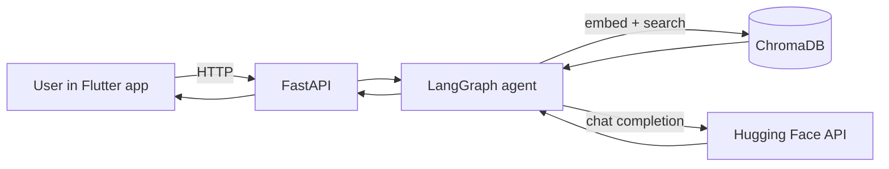

# AI Chat Application

A full-stack **AI assistant** with a modern mobile/desktop UI and an intelligent backend. Users can chat in natural language, upload custom knowledge, and get answers grounded in indexed content—or general AI replies when appropriate.

Built as a portfolio project to demonstrate **Flutter**, **Python/FastAPI**, **retrieval-augmented generation (RAG)**, and **AI-assisted development with Cursor**.

---

## At a glance (for reviewers)

| | |
|---|---|
| **Type** | Cross-platform chat app + REST API |
| **Front-end** | Flutter (Android, iOS, Windows, Web) |
| **Back-end** | Python, FastAPI, LangGraph |
| **AI** | Hugging Face Inference API (chat + embeddings) |
| **Data** | ChromaDB vector store for semantic search |
| **Development** | Cursor IDE (AI pair programming) |

---

## What it does

- **Conversational AI** — Ask questions; the app routes them through a LangGraph pipeline (retrieve context → generate answer).
- **Custom knowledge base** — Paste notes, policies, or FAQs in **Settings → Add Knowledge**; answers can use that content (RAG).
- **Suggested prompts** — Quick-start chips such as *how to make pasta*, *what is today news*, *how to make tea*.
- **Multi-language UI** — English, Spanish, French, German, Hindi.
- **Chat history** — Save, reopen, export, and share conversations.
- **Attachments & voice** — File/image context and speech-to-text input (platform-dependent).
- **Theming** — Dark/light mode, accent colors, wallpapers, bubble styles.

---

## Applications & use cases

| Scenario | How this app helps |
|----------|-------------------|
| **HR / onboarding** | Index handbook snippets; new hires ask “What is the leave policy?” and get answers from uploaded text. |
| **Internal support** | IT or ops teams add runbooks; staff query procedures without searching long documents. |
| **Product demo** | Shows end-to-end AI integration: UI, API, vector DB, and LLM—not a static mockup. |
| **Learning & portfolio** | Demonstrates LangGraph orchestration, RAG, and cross-platform Flutter in one repo. |
| **Prototype for customer chat** | Same architecture can extend to Slack/Teams bots or a public web widget. |

*Note: “Today’s news” and other live data require external APIs or indexed news feeds; the demo uses the LLM’s general knowledge when nothing is in the knowledge base.*

---

## Tech stack

### Front-end (Flutter)

| Technology | Purpose |
|------------|---------|
| **Flutter 3** | Single codebase for mobile, desktop, and web |
| **Provider** | App state (chat, theme, locale, backend health) |
| **HTTP** | REST calls to the Python API |
| **Shared preferences** | Backend URL, theme, and session preferences |
| **google_fonts**, **flutter_animate** | UI polish and motion |
| **speech_to_text**, **file_picker**, **image_picker** | Voice and attachments |
| **share_plus**, **path_provider** | Export and share chats |

### Back-end (Python)

| Technology | Purpose |
|------------|---------|
| **FastAPI** | REST API (`/api/chat`, `/api/health`, `/api/knowledge`) |
| **Uvicorn** | ASGI server |
| **LangGraph** | Agent workflow: `retrieve` → `generate` |
| **ChromaDB** | Persistent vector store for RAG |
| **Hugging Face Hub** | Embeddings + chat completions (Inference API) |
| **Pydantic Settings** | Configuration from `backend/.env` |

### AI pipeline (conceptual)



1. **Retrieve** — Embed the user question, search ChromaDB for similar documents.  
2. **Generate** — Send relevant context + conversation history to the chat model.  
3. **Fallback** — If no knowledge matches, the model can still answer from general knowledge (when the API key is configured).

---

## Project structure

```
Chat-Application/
├── lib/                      # Flutter UI
│   ├── screens/              # Chat, settings, history
│   ├── providers/            # State management
│   ├── services/             # API, attachments, export
│   └── widgets/              # Bubbles, input bar, themes
├── backend/
│   ├── app/
│   │   ├── main.py           # FastAPI app
│   │   ├── api/routes.py     # Endpoints
│   │   ├── graph/agent.py    # LangGraph workflow
│   │   └── services/         # ChromaDB, Hugging Face
│   ├── requirements.txt
│   ├── run.py                # Start server
│   └── .env.example          # Config template (copy to .env)
├── README.md                 # This file
└── DEPLOY.md                 # Optional cloud deployment
```

---

## Cursor IDE contribution

This project was developed and refined using **[Cursor](https://cursor.com)**—an AI-native code editor. Cursor acted as a **pair-programming assistant**, not a replacement for engineering judgment.

### How Cursor was used

| Area | Contribution |
|------|----------------|
| **Architecture** | Scaffolded LangGraph retrieve/generate flow, FastAPI routes, and Flutter provider pattern. |
| **Debugging** | Traced RAG failures (embedding bugs, `.env` path, distance thresholds) and demo-mode issues. |
| **UI/UX** | Updated copy for HR-friendly demo, suggested prompts, and settings flows. |
| **Config & ops** | Fixed `backend/.env` loading from any working directory; reindex API and startup hooks. |
| **Tests** | Backend unit tests for sanitization, query helpers, and embedding handling. |
| **Documentation** | Drafted and structured this README for technical and non-technical audiences. |

### What remained human-led

- Product goals (chat + knowledge base + portfolio presentation)  
- Security choices (API keys in `.env` only, never committed)  
- Final review of AI-suggested code before merge  
- Demo narrative for HR and stakeholders  

*For interviews: describe Cursor as accelerating implementation and debugging while you owned design decisions, testing, and deployment.*

---

## Prerequisites

| Tool | Version (approx.) |
|------|-------------------|
| **Flutter SDK** | 3.11+ ([install](https://docs.flutter.dev/get-started/install)) |
| **Python** | 3.11 or 3.12 |
| **Hugging Face account** | Free token for full AI responses ([settings/tokens](https://huggingface.co/settings/tokens)) |

---

## How to run (demo for HR or local dev)

### Step 1 — Backend

```powershell
cd backend
python -m venv venv
.\venv\Scripts\activate
pip install -r requirements.txt
copy .env.example .env
```

Edit `backend\.env` and set:

```env
HUGGINGFACE_API_KEY=hf_your_token_here
```

Start the API (always from the `backend` folder):

```powershell
python run.py
```

Verify in a browser:

- Health: http://127.0.0.1:8000/api/health → `"huggingface_configured": true`  
- API docs: http://127.0.0.1:8000/docs  

### Step 2 — Flutter app

Open a **new** terminal at the project root:

```powershell
cd c:\Work\Project\Chat-Application
flutter pub get
flutter run
```

Choose a device (Chrome, Windows, or an emulator).

### Step 3 — Connect the app

1. Open **Settings** in the app.  
2. Set **API Base URL** to `http://127.0.0.1:8000` (see table below for other targets).  
3. Tap **Save & Test Connection** — status should show **Connected**.  
4. Return to chat and try a suggested prompt or type your own question.

| Running the app on | Backend URL |
|--------------------|-------------|
| Windows / Chrome / iOS simulator | `http://127.0.0.1:8000` |
| Android emulator | `http://10.0.2.2:8000` |
| Physical phone (same Wi‑Fi as PC) | `http://YOUR_PC_IP:8000` |

### Optional — Add demo knowledge for HR

1. **Settings → Add Knowledge** — paste a short company blurb or FAQ.  
2. Tap **Index in ChromaDB**.  
3. Ask a question about that text to show **RAG** (answers from your content).

---

## API reference (summary)

| Method | Path | Description |
|--------|------|-------------|
| `GET` | `/api/health` | Backend status, model info, document count |
| `POST` | `/api/chat` | Send message + optional history |
| `POST` | `/api/knowledge` | Index new text in ChromaDB |
| `POST` | `/api/knowledge/seed` | Load default seed documents |
| `POST` | `/api/knowledge/reindex` | Rebuild embeddings (after API key fix) |

---

## Configuration (`backend/.env`)

| Variable | Description |
|----------|-------------|
| `HUGGINGFACE_API_KEY` | Required for real LLM replies |
| `HF_CHAT_MODEL` | Default: `HuggingFaceH4/zephyr-7b-beta` |
| `HF_EMBEDDING_MODEL` | Default: `sentence-transformers/all-MiniLM-L6-v2` |
| `HF_PROVIDER` | Inference provider (e.g. `featherless-ai`) |
| `CHROMA_PERSIST_DIR` | Vector DB folder (resolved under `backend/`) |
| `RAG_MAX_DISTANCE` | Similarity threshold for retrieval (default `0.72`) |

Without a valid API key, the server runs in a limited **demo mode** with placeholder messages.

---

## Skills demonstrated (resume / interview)

- Cross-platform **Flutter** UI with state management and localization  
- **REST API** design with FastAPI and OpenAPI docs  
- **RAG**: embeddings, vector search, context-aware generation  
- **LangGraph** for explicit AI workflow steps  
- **Environment and security** practices (secrets in `.env`, gitignore)  
- **AI-assisted development** with Cursor for faster iteration and debugging  

---

## Deployment (optional)

For a public demo URL, see **[DEPLOY.md](DEPLOY.md)** (e.g. Render for the API, GitHub Pages / Netlify for Flutter web).

---

## Troubleshooting

| Issue | Fix |
|-------|-----|
| Demo mode / “set HUGGINGFACE_API_KEY” | Add key to `backend\.env`, restart server from `backend` folder |
| “Knowledge base” for every question | **Settings → Rebuild search index**; confirm HF configured in health check |
| App cannot reach backend | Check URL, firewall, and that `python run.py` is running |
| Android emulator | Use `http://10.0.2.2:8000` not `127.0.0.1` |

---

## Security & repo hygiene

Do **not** commit:

- `backend/.env` (API keys)  
- `backend/venv/`, `backend/chroma_data/`, `build/`  

Copy `backend/.env.example` → `backend/.env` on each machine.

---

## License

MIT

---

## Presenting to HR — 5-minute script

1. **Open the app** — Show the assistant screen and suggested questions.  
2. **Send a message** — e.g. “how to make pasta” (general AI answer).  
3. **Show Settings** — Add a short “company policy” paragraph and index it.  
4. **Ask about that policy** — Demonstrate answers from *your* knowledge, not generic text.  
5. **Mention stack** — Flutter UI + Python API + vector search + Hugging Face, built with Cursor as a development accelerator.
